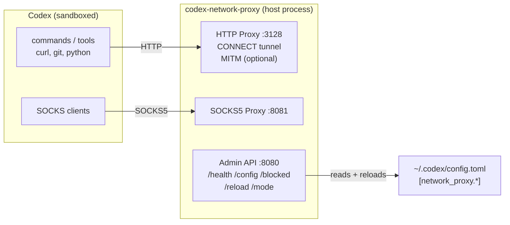

# Codex Network Proxy Design

This document describes the Codex network proxy that runs outside the sandbox and enforces an allow-only network policy for sandboxed subprocesses. The proxy is a single binary with HTTP proxying, SOCKS5, and an admin API. Codex owns the policy state in `~/.codex/config.toml`; the proxy reads that configuration and applies it at the network edge.

## Goals

1. Enforce allow-only network access with denylist precedence.
2. Support wildcard domain patterns, including apex match for `*.domain.tld`.
3. Allow two modes: **limited** (read-only) and **full** (all methods).
4. Provide optional **MITM** to enforce read-only on HTTPS.
5. Allow hot-reloaded configuration via admin API.
6. Provide clear audit logging of allow/deny decisions and policy changes.
7. Enable a single binary with HTTP proxy, SOCKS5 proxy, and admin API.

## Non-Goals

- Enterprise policy distribution or centralized multi-tenant orchestration.
- Deep packet inspection beyond the supported HTTP/HTTPS interception modes.
- Perfect protocol coverage for all network traffic types.

## Architecture

## Configuration Model

The proxy reads `~/.codex/config.toml`:

- `[network_proxy]` for endpoints, mode, and toggles.
- `[network_proxy.policy]` for `allowed_domains` / `denied_domains` (and, on macOS, optional local IPC allowances).
- `[network_proxy.mitm]` for MITM CA paths and inspection settings.

Codex is the source of truth. Approval actions update the config and trigger a proxy reload.

## Enforcement Model

- **Allow/deny precedence:** denylist wins; allowlist is required for access.
- **Limited mode:** only GET/HEAD/OPTIONS are permitted. HTTPS requires MITM to enforce method constraints; otherwise CONNECT is blocked with a clear reason.
- **Full mode:** all methods allowed; CONNECT tunneling is permitted without MITM.

## macOS Sandbox Integration (Seatbelt)

On macOS, Codex uses Seatbelt (`sandbox-exec`) for OS-level enforcement.

Key points:

- **Per-domain gating happens in the proxy**, not in Seatbelt: Seatbelt network rules are intentionally limited to loopback proxy ports (e.g. `localhost:3128` / `localhost:8081`) so all outbound traffic is forced through the proxy, which then applies the allow/deny policy and prompts.
- **Local IPC is deny-by-default** when proxy-restricted network access is active. Some tools rely on Unix domain sockets (e.g. the SSH agent). These are blocked unless explicitly allowed via:
  - `network_proxy.policy.allow_unix_sockets` (absolute socket paths, `$SSH_AUTH_SOCK`, or the `ssh-agent` preset), and/or
  - `network_proxy.policy.allow_local_binding` (if you need to bind/listen on localhost ports).

When approvals are enabled, Codex can preflight commands that appear to require the SSH agent and prompt to allow the SSH agent socket before running.

## Logging and Auditability

The proxy logs:

- Allow/deny decisions (host, client, reason).
- Policy updates (allowlist/denylist adds/removes).
- Mode changes and config reloads.
- MITM lifecycle events (CA generated, TLS established).

## Decision to Make: Preflight Strictness

Codex performs a preflight check before running some commands. Preflight currently scans CLI args for URLs on known network tools (curl, git, etc.) and shell `-c` snippets.

We need to decide how strict preflight should be:

Option A: **Heuristic preflight (current)**
- Pros: catches obvious `curl https://...` style commands early.
- Cons: misses dynamic URLs inside scripts; can still overprompt on shell snippets.

Option B: **Strict preflight**
- Only preflight when a URL argument is present in the command.
- For everything else, rely on the proxy `/blocked` prompt at connect time.
- Pros: fewer false positives, clearer user experience.
- Cons: fewer early prompts; approvals shift to runtime events.

Decision: **TBD**. We should choose a configuration flag (`network_proxy.preflight_mode = "heuristic" | "strict"`) and default based on observed UX.

## Open Items

- Finalize preflight strictness and expose a config toggle if needed.
- Confirm documentation for MITM trust steps and CA injection into sandboxed commands.
